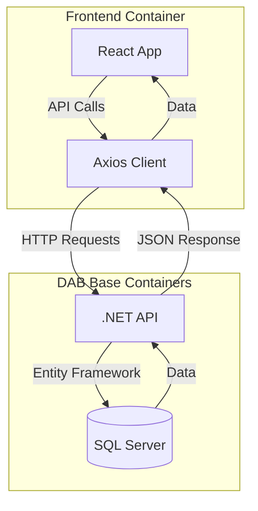
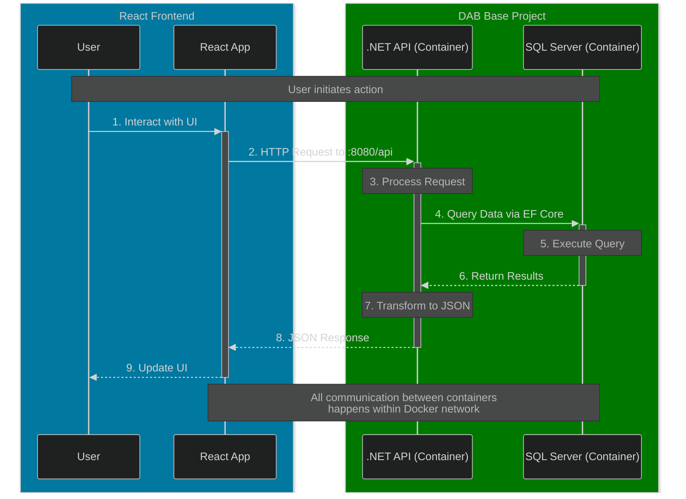
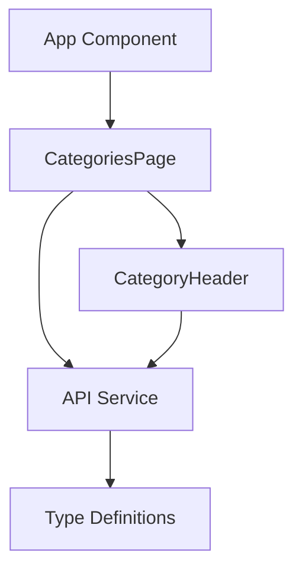
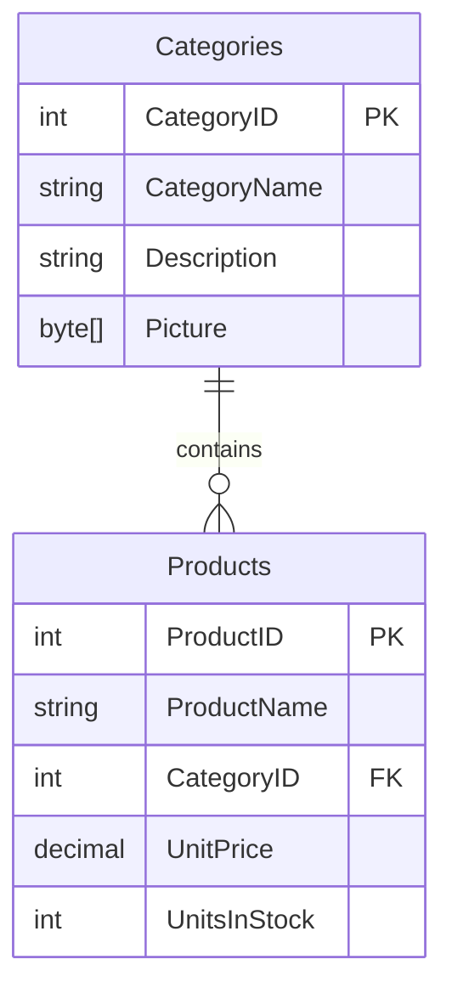

# DAB React Demo 🚀

A modern React application demonstrating product and category management with a RESTful API backend.

## 🔧 About DAB Base

DAB Base ([repository](https://github.com/Dab-Development-Team/dab-base)) is the backbone of this application, providing a robust and scalable backend infrastructure:

### What is DAB Base? 🤔
- A containerized backend service built with .NET and SQL Server
- Provides a RESTful API for managing products and categories
- Implements the Northwind database schema with modern improvements
- Runs in Docker for easy deployment and development

### Why DAB Base? 💡
- **Development Speed**: Pre-configured database and API endpoints
- **Standardization**: Follows REST best practices and modern API design
- **Reliability**: Built on proven technologies (.NET, SQL Server)
- **Scalability**: Containerized architecture for easy scaling
- **Testing**: Provides a consistent environment for integration testing

### How it Works 🔄
1. **Docker Containers**:
   - SQL Server container for data storage
   - .NET API container for business logic and routing

2. **API Layer**:
   - RESTful endpoints for CRUD operations
   - JSON response format
   - Built-in validation and error handling
   - Swagger documentation included

3. **Database**:
   - Based on Northwind schema
   - Optimized for modern applications
   - Includes sample data for testing

## ✨ Features

- **Category Management** 📁
  - Create, read, update, and delete product categories
  - Hierarchical organization of products
  - Real-time category updates

- **Product Management** 📦
  - Full CRUD operations for products
  - Product categorization
  - Price and inventory tracking
  - Bulk operations support

- **Modern UI/UX** 🎨
  - Responsive design
  - Clean and intuitive interface
  - Real-time updates
  - Error handling and user feedback

## 🛠️ Technical Stack

### Frontend 🌐
- React 18+
- TypeScript
- Axios for API communication
- Modern React hooks and patterns
- Jest for testing

### Backend (DAB Base) 🖥️
- .NET 6+ Web API
- SQL Server 2019
- Entity Framework Core
- Docker containerization

### API Integration 🔌
- RESTful API endpoints
- JSON response format
- Comprehensive error handling
- Request/response validation
- Swagger/OpenAPI documentation

## 📁 Project Structure

```
client/
├── public/              # Static files
├── src/
│   ├── components/      # React components
│   │   ├── CategoriesPage.tsx
│   │   └── CategoryHeader.tsx
│   ├── services/        # API and service layer
│   │   ├── api.ts      # API integration
│   │   └── __tests__/  # Integration tests
│   └── types/          # TypeScript type definitions
└── package.json        # Project dependencies
```

## 🔗 API Endpoints

### Categories
- `GET /api/categories` - List all categories
- `POST /api/categories` - Create a new category
- `PATCH /api/categories/CategoryID/:id` - Update a category
- `DELETE /api/categories/CategoryID/:id` - Delete a category

### Products
- `GET /api/products/CategoryID/:categoryId` - List products by category
- `POST /api/products` - Create a new product
- `PATCH /api/products/ProductID/:id` - Update a product
- `DELETE /api/products/ProductID/:id` - Delete a product

## 🧪 Testing

The project includes comprehensive integration tests for both the category and product APIs:

### Category Tests 📁
- Category lifecycle (create, read, update, delete)
- Input validation
- Error handling
- Edge cases

### Product Tests 📦
- Product lifecycle management
- Category association
- Data validation
  - Required fields
  - Data types
  - Value constraints
- Concurrent operations
- Error scenarios
- Edge cases

Run tests using:
```bash
cd client
npm test
```

## 🚀 Getting Started

### Prerequisites

- Node.js 14+ and npm
- Docker for running [dab-base](https://github.com/Dab-Development-Team/dab-base)
- Git

### Setup Steps

1. Clone the repositories:
```bash
# Clone the React frontend
git clone https://github.com/vvidov/dabBaseReactDemo.git
cd dabBaseReactDemo

# Clone dab-base for the backend
git clone https://github.com/Dab-Development-Team/dab-base.git
cd dab-base
```

2. Start the backend:
```bash
cd dab-base
docker-compose up -d
```

3. Install frontend dependencies:
```bash
cd ../client
npm install
```

4. Configure environment:
```bash
# Create .env file in client directory
echo "REACT_APP_API_URL=http://localhost:8080/api" > .env
```

5. Start the development server:
```bash
npm start
```

6. Run tests:
```bash
npm test
```

### Verifying Setup

1. Backend verification:
   - Open `http://localhost:8080/api/categories` in your browser
   - You should see a JSON response with categories

2. Frontend verification:
   - Open `http://localhost:3000` in your browser
   - You should see the category management interface
   - Try creating a new category to verify API connectivity

### Troubleshooting

- If the API is not accessible, ensure dab-base containers are running:
  ```bash
  docker ps
  ```

- Check dab-base logs for errors:
  ```bash
  cd dab-base
  docker-compose logs
  ```

- Verify environment variables:
  ```bash
  cat client/.env
  ```

- Clear Docker cache if needed:
  ```bash
  docker-compose down
  docker-compose build --no-cache
  docker-compose up -d
  ```

## 📝 Development Guidelines

### Code Style ⚡
- Use TypeScript for type safety
- Follow React best practices and hooks
- Maintain consistent error handling
- Write comprehensive tests
- Use meaningful variable and function names

### Testing Guidelines 🧪
- Write tests for all new features
- Include both happy path and error scenarios
- Test edge cases and validation
- Maintain test isolation
- Clean up test data after each test

### Git Workflow 🔄
- Use meaningful commit messages
- Follow conventional commits format
- Keep changes focused and atomic
- Write descriptive PR descriptions

## ⚠️ Error Handling

The application implements comprehensive error handling:

- API errors with appropriate status codes
- User-friendly error messages
- Validation feedback
- Network error handling
- Concurrent operation management

## 🔮 Future Enhancements

- [ ] Add authentication and authorization 🔐
- [ ] Implement real-time updates using WebSocket 🔄
- [ ] Add bulk operations for products 📦
- [ ] Enhance search and filtering capabilities 🔍
- [ ] Add image upload for products and categories 📸
- [ ] Implement caching for better performance ⚡

## 🤝 Contributing

1. Fork the repository from [dabBaseReactDemo](https://github.com/vvidov/dabBaseReactDemo)
2. Create your feature branch (`git checkout -b feature/AmazingFeature`)
3. Commit your changes (`git commit -m 'Add some AmazingFeature'`)
4. Push to the branch (`git push origin feature/AmazingFeature`)
5. Open a Pull Request to the main repository

## 📄 License

This project is licensed under the MIT License - see the LICENSE file for details.

### System Architecture 🏗️



### Data Flow 🔄



### Component Structure 🏢



### Database Schema 📊


